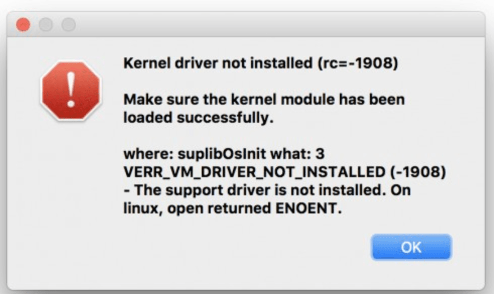
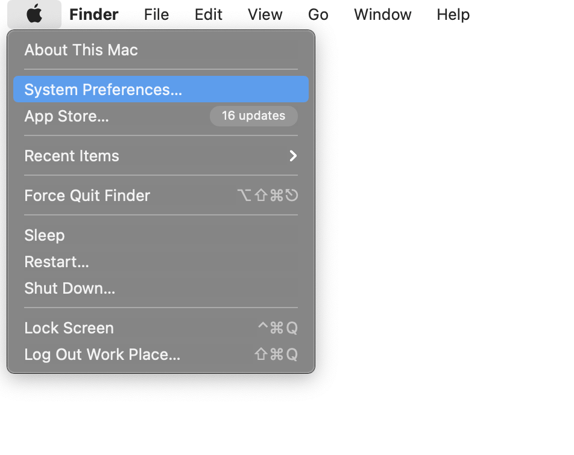
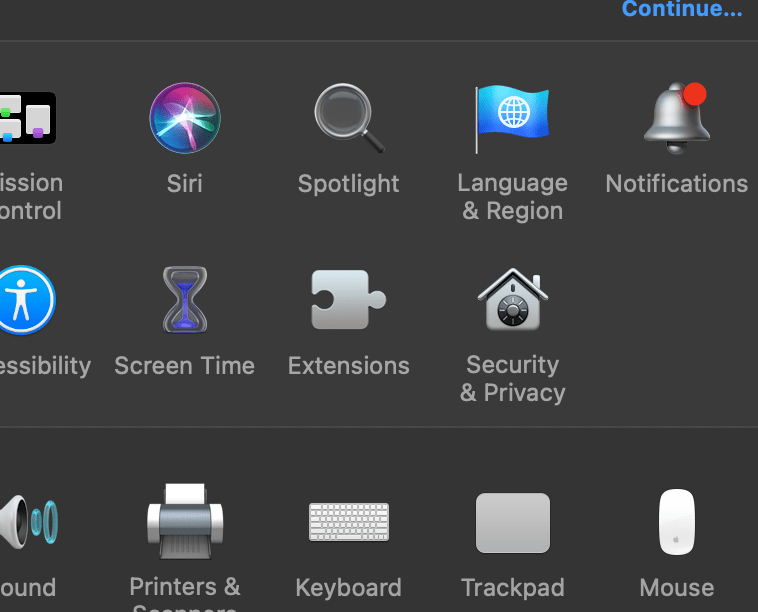
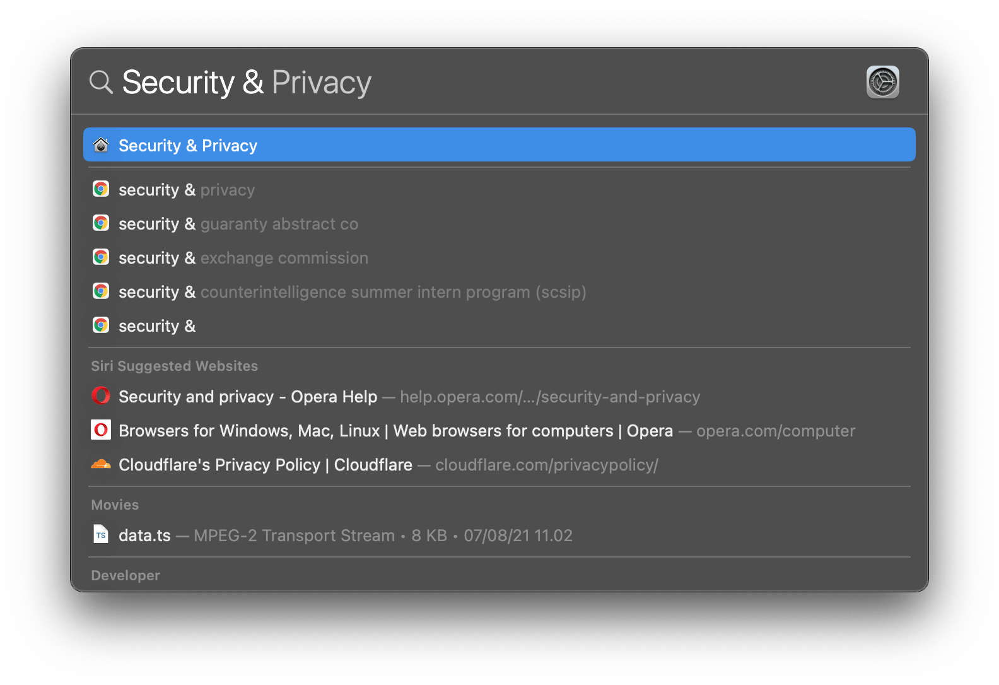
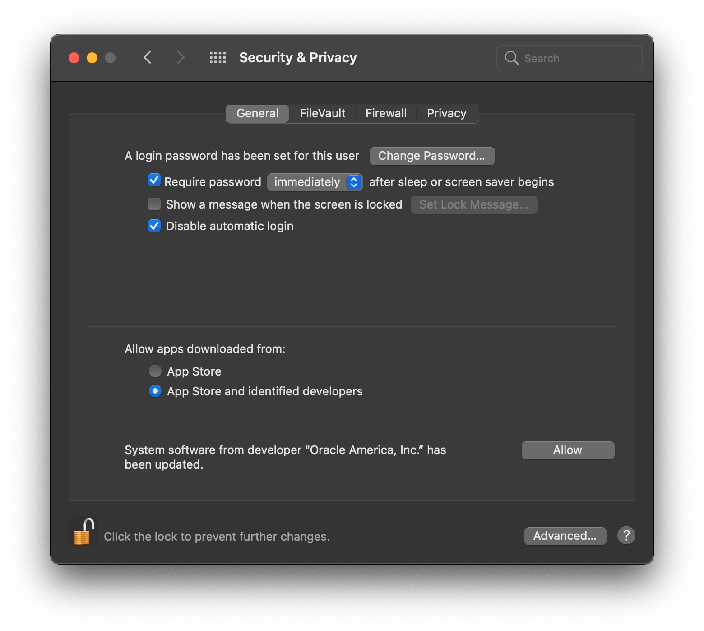
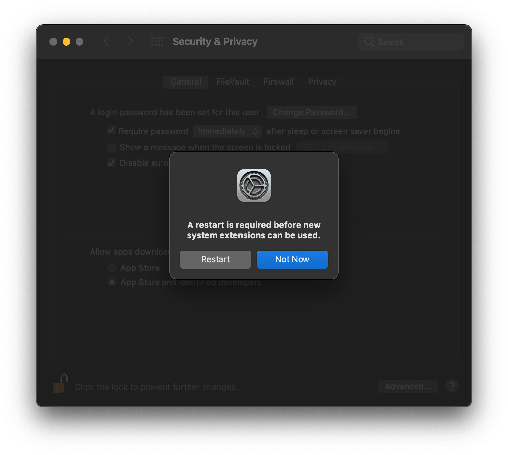
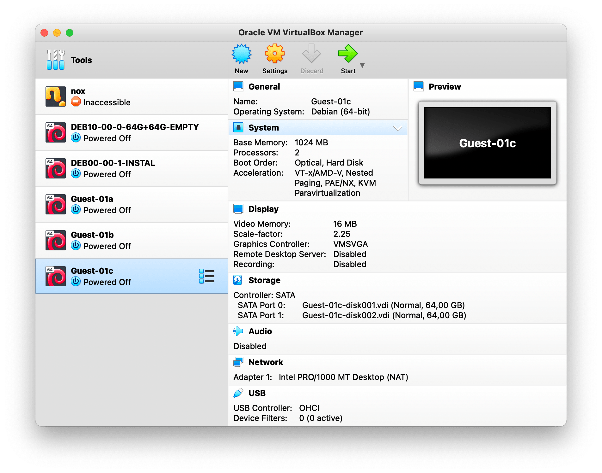
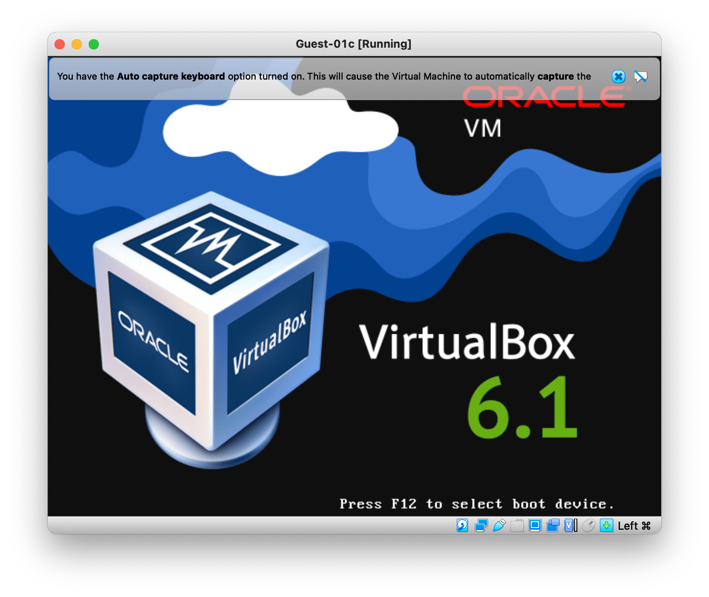

# Kernel Driver Error While Running VirtualBox

### When you are trying to run your Debian Guest in VirtualBox, you probably will see this error that caused by incomplete setup of the Kernel Driver.  

### Therefore, there are several steps you need to do.   

## 1. Open Security & Privacy System Preferences

### Click on the Apple logo on top left of your screen, or simply press &#8984; + `space` and type `Security & Privacy`

  

  

   

## 2. Click on **Allow** button at bottom right

   

## 3. Restart device

   

## 4. Reopen VirtualBox

   

## 4. Rerun Debian Guest

   
